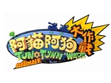
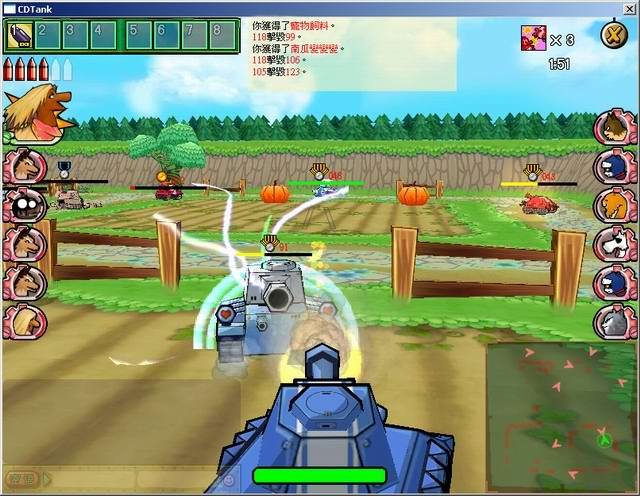
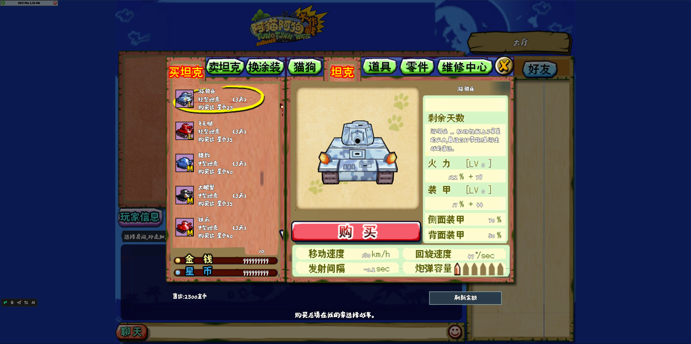
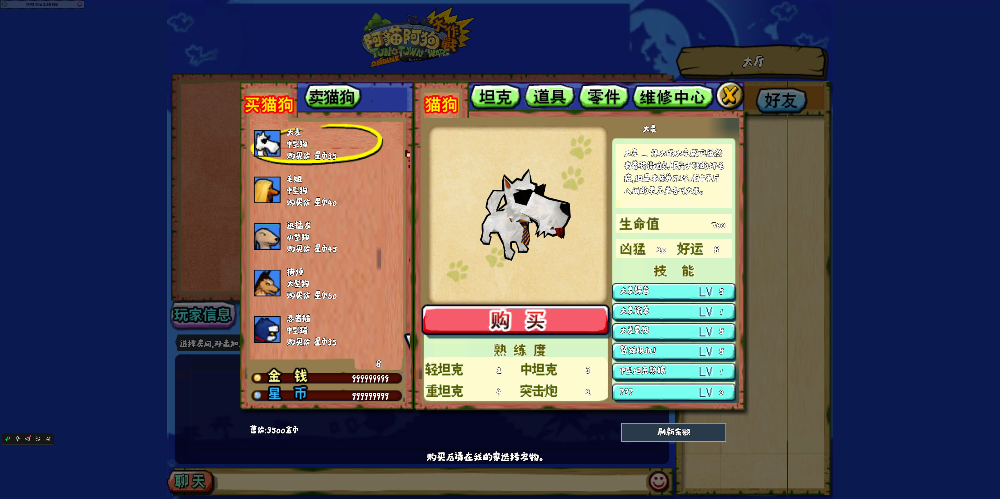
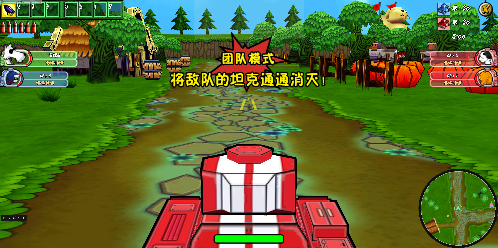
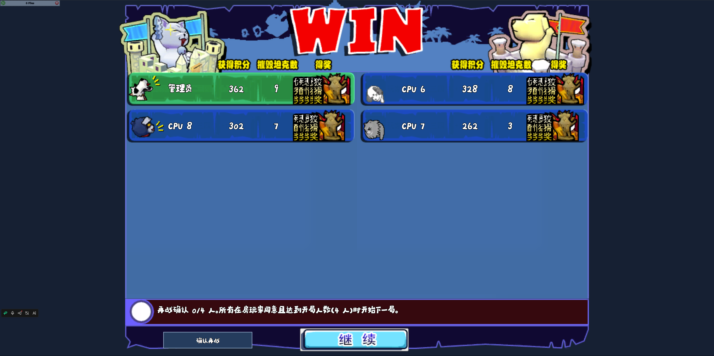

# CDTank · 阿猫阿狗大作战复刻

当前版本：**0.9.0** · [更新日志](CHANGELOG.md#090--2026-10-07)



**《阿猫阿狗大作战 Online》的非官方 Web 复刻项目。** 使用原 Windows 客户端的资源、数据表和程序行为作为依据，以 Babylon.js、React 和 TypeScript 重建浏览器客户端，以 Node.js 和 TSRPC 实现联机服务端，让猫狗战车重新驶回木桶镇。

原作由上海软星制作、大宇资讯发行，是《阿猫阿狗》系列的休闲坦克射击网游，2006 年推出。玩家操控猫狗角色驾驶战车，在木桶镇的街头巷尾交战，画面沿用系列的卡通渲染风格。背景资料见[原作介绍](docs/game-background.md)。



*原作参考画面，来源为巴哈姆特作品资料页；图片出处和权利说明见[素材来源](docs/assets/README.md)。*

## 当前内容

- **联机对战**：创建和加入房间、密码房、换队、准备、战斗、结算及再战。
- **五种模式**：团队、占领、擒王、混战、破坏；载入原表中的 26 个模式／地图组合。
- **战车与场景**：21 种原版战车，恢复地图、部件、宠物、动画、界面图块、音乐和音效。
- **账户与角色**：注册登录、我的家、库存与装备、商城及社交功能，保存角色成长、称号与账户资料。
- **成长与交易**：战车火力／装甲改造、宠物技能学习确认、装饰部件购买、贵重品数量出售与维修计时。
- **玩家与社交**：公开资料、精确昵称查找、家族聊天，以及 GM 问题提交和回复收件箱；家族归属与人工回复由本机运营者管理。
- **战斗统计**：记录每局射击、命中、伤害和连杀等统计，结算九项战斗奖章，累计战绩与实际消费保存到 SQLite。
- **CPU 对手**：可在等待房间添加 CPU，通过同一套战斗输入和规则参与对局。
- **资源工具**：独立资源查看器，以及 CPK、MV3、POL、CVD 和数据表的提取与转换工具。
- **显示与加载**：窗口／全屏、画质和卡通描边设置，图片缓存与加载恢复，以及离线高清素材和模型预览工具。

项目仍在持续还原中。完整原版规则、全部技能道具、界面表现和高清多人性能的完成情况，以[任务清单](recovery/docs/tasklist.md)和各专题证据为准。

## 项目截图

### 战车商城



### 猫狗商城



### 团队模式



### 战斗结算



## 本地运行

需要 **Node.js 24.16 或更高版本**、浏览器和支持 `.tar.xz` 的 `tar`。高清贴图、模型、音频、界面、字体和数据表通过 [GitHub Releases](https://github.com/qq617564112/cdtank/releases/tag/v0.9.0) 提供，安装脚本自动下载解压，无需原客户端、Python 或另行准备字体。Windows 10/11 和 macOS 使用系统 `tar`；Linux 需安装 `tar` 和 `xz-utils`。以下命令在仓库根目录执行。

### 1. 安装依赖和资源

克隆仓库或下载 ZIP 并解压后安装依赖：

```bash
npm ci
npm run assets:install
```

脚本下载 `cdtank-assets-0.9.0.tar.xz`，将运行资源解压到 `recovery/output/web-assets/`，内容表解压到 `recovery/output/verified/tables/`，地图预览、角色缩略图和界面图片解压到 `apps/web/src/assets/`。解压后约占 6.81 GB，包含所需字体、已转换的移动数据、测试地图和高清田野路。使用旧版资源包的用户重新运行 `npm run assets:install` 即可升级。

### 2. 启动服务端和网页

在两个终端中分别运行：

```bash
# 终端一：联机服务端，默认端口 3001
npm run dev:server
```

```bash
# 终端二：Web 客户端，默认端口 5173
npm run dev
```

打开 [http://localhost:5173](http://localhost:5173)，注册或登录，选择频道进入大厅，创建或加入房间，资源加载完成后点击准备。默认开局人数由地图原表决定；可在等待房间添加 CPU 补足人数，也可用多个浏览器窗口加入同一房间。

开场先显示模式介绍和战斗提示，提示结束后开始计时并开放操作。结算画面保留最后的战场状态，可继续投票再战或返回大厅。

| 默认按键 | 操作 |
| --- | --- |
| W / S | 前进 / 后退 |
| A / D | 车身左转 / 右转 |
| ← / → | 炮塔左转 / 右转 |
| 空格 | 开火 |
| 1–8 | 请求使用对应快捷槽 |

按键可在设置中调整。道具是否生效取决于账户库存和对应功能的还原状态。

### 3. 查看原版资源

```bash
npm run tools:assets:dev
```

打开 [http://localhost:5211](http://localhost:5211)，浏览模型、地图和动画。查看器与正式游戏共用转换资源，入口独立。

## 目录

```text
apps/
  web/                  浏览器客户端：界面、渲染、音频与对局
  server/               联机服务端：房间、战斗、账户与社交
  shared/               通信协议、共同契约和两端共用规则
docs/                   项目介绍、开发指南与图片来源
recovery/
  *.py                  原客户端格式解析、资源导出与转换
  docs/                 还原任务、来源依据与专题说明
  evidence/             原程序行为取证脚本和对应实现
  prepared/             还原切片与部分验证所用的候选实现
  implementation/       待集成的界面实现稿
  output/web-assets/    安装脚本下载的模型、贴图、音频、界面与字体
  output/verified/tables/ 安装脚本下载的解码数据表
scripts/                构建、资源重建、打包和账户备份脚本
deployment/             运行配置、反向代理与存档说明
tools/asset-viewer/     独立资源查看器
tests/                  现有资产、规则、联机和页面验收入口
```

运行资源单独发布到 GitHub Releases。原客户端 `CDTank/`、下载与提取输出 `recovery/output/`、账户数据库、`node_modules/` 和 `dist/` 由 `.gitignore` 排除。

## 文档

| 内容 | 入口 |
| --- | --- |
| 版本变化 | [更新日志](CHANGELOG.md) |
| 原作背景与参考资料 | [原作介绍](docs/game-background.md) |
| 图片出处与权利归属 | [素材来源](docs/assets/README.md) |
| 开发命令、配置与项目范围 | [开发指南](docs/development.md) |
| 当前还原状态与专题导航 | [还原文档索引](recovery/docs/README.md) |
| 可选：从原客户端重新生成资源 | [资源重建](recovery/docs/reproducible-assets.md) |
| 生产部署与账户备份恢复 | [运行与账户存档](deployment/operations.md) |
| GitHub 源码发布 | [发布说明](docs/github-publication.md) |

## 素材与许可

原作名称、美术、模型、音频、界面和其他游戏素材的权利归相应权利人所有。仓库中的原作参考图片用于介绍复刻对象，图片来源记录在[素材来源](docs/assets/README.md)。本项目与原作开发商、发行商没有官方关联。

Release 资源包包含从原客户端提取并转换的运行资源，以及运行所用的第三方字体，来源见[素材来源](docs/assets/README.md)。仓库尚未指定代码开源许可证，原作素材和第三方字体保留各自权利。
